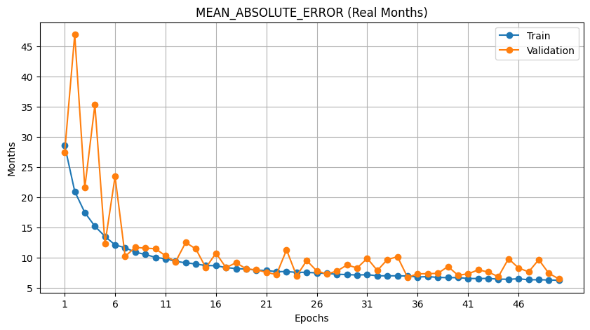

# 🦴 Bone Age Assessment using Deep Learning

This project focuses on **automatic bone age prediction from hand X-ray images** using deep learning.  
The model estimates a child’s bone age (in months) from hand radiographs to support pediatric growth assessment.

---

## 📌 Project Overview

**Task:** Bone Age Regression (Age in months)  
**Dataset:** Hand X-ray Bone Age Dataset  
**Problem Type:** Medical Image Regression  
**Framework:** Deep Learning (CNN)  
**Input Size:** 224 × 224  
**Loss Function:** Mean Absolute Error (MAE)  
**Evaluation Metrics:** MAE, RMSE  

---

## 📂 Dataset Preparation

Hand X-ray images and their corresponding bone age labels are loaded and processed.

Each sample consists of:

- 🖼️ Hand X-ray image  
- 🔢 Bone age label (in months)

### 🔹 Preprocessing Steps

- Image resizing to **224 × 224**  
- Pixel normalization  
- Train–Validation split  

---

## 🔄 Data Augmentation

To improve generalization and reduce overfitting, augmentations were applied during training:

- Random Horizontal Flip  
- Small Rotations  
- Brightness & Contrast Adjustment  
- Random Cropping & Resizing  
- Normalization  
- Conversion to Tensor  

---

## 🏗 Model Architecture

### 🔹 CNN-Based Bone Age Regressor

**Backbone:** Convolutional Neural Network (Transfer Learning)  
**Head:** Fully connected regression layers  
**Output:** Single continuous value → **Predicted Bone Age (months)**

**Key Components:**

- Pretrained feature extractor  
- Global pooling layer  
- Fully connected regression head  
- Linear output (no activation)

---

## ⚙️ Training Details

| Parameter        | Value |
|------------------|-------|
| Epochs           | 50 |
| Loss Function    | MAE |
| Evaluation Metric| MAE & RMSE |
| Best Model       | Saved based on lowest validation MAE |

---

## 📈 Best Validation Results (Real Months)

**Best Epoch:** **Epoch 50**

| Metric | Training | Validation |
|--------|----------|------------|
| **MAE** | **9.56 months** | **9.90 months** |
| **RMSE** | **12.45 months** | **13.64 months** |

**Inference Speed:**  
1573 steps completed in **56s** (≈ **35 ms/step**)

---

## 📉 Training Curve (Validation MAE in Real Months)



---

## 🧪 Model Evaluation

The trained model demonstrates strong performance in estimating bone age from unseen hand X-rays, with an average error of **~10 months** on the validation set.

---

## 🚀 How to Run

```bash
pip install -r requirements.txt
jupyter notebook bone-age-assessment.ipynb
